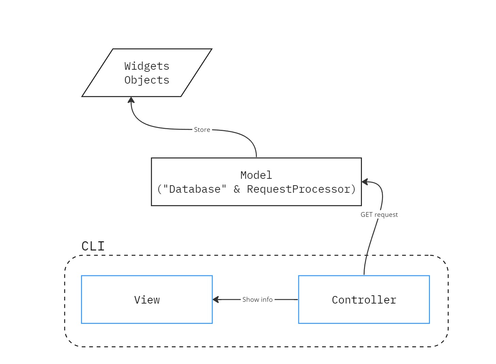
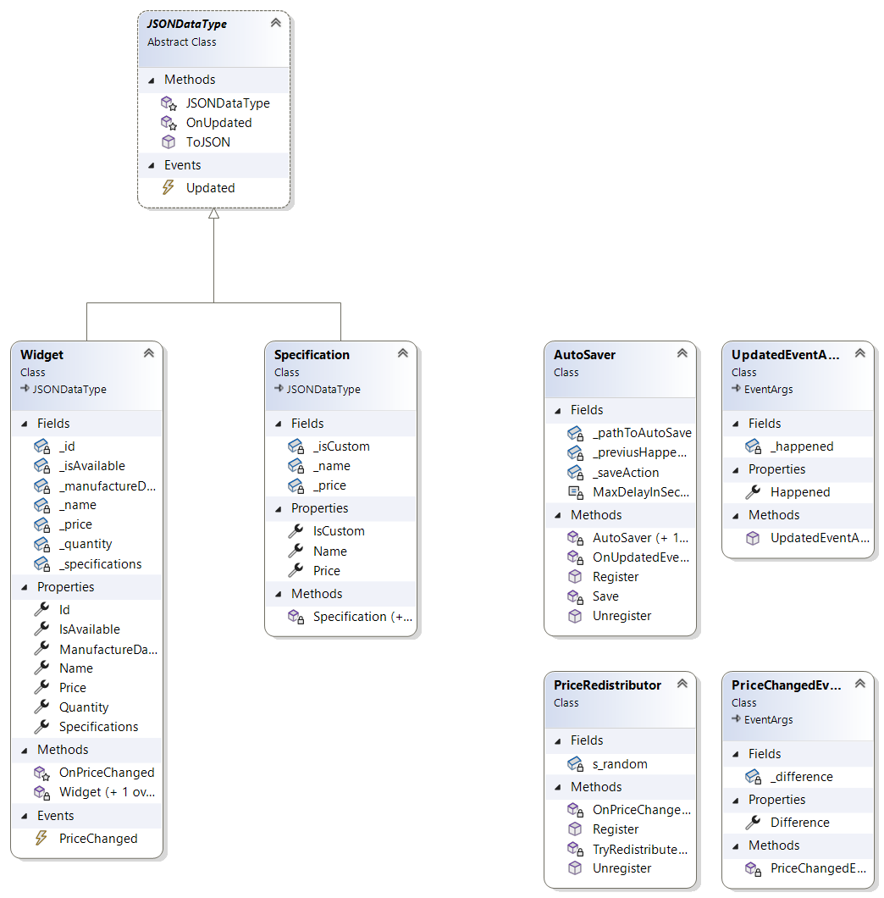
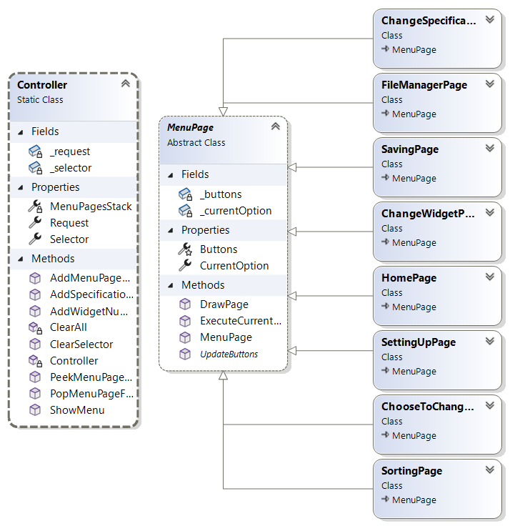

# WidgetsJSONProcessing (КДЗ_3_2 | Вариант 4)

## Преамбула

Считаю, что было бы некорректным делать огромные блоки текста, обосновывающие те либо иные пути решения проблемы, поэтому краткое описание будет в этом README файле.

## Архитектура решения

В рамках работы над проектом были учтены лучшие практики построения подобных решений. В качестве референсной архитектуры был выбран подход [Model-View-Controller](https://www.ibm.com/docs/en/radfws/9.6.1?topic=cycle-model-view-controller-architecture).

Смысл в том, чтобы отделить [хранение данных](Model/Database.cs) от интерфейса взаимодействия с пользователем, лишь посылать запросы в обработчик [RequestProcessor](Model/RequestProcessor.cs).

### Реализация основных классов и Event Pattern

Учитывая, что [`AutoSaver`](WidgetsJSON/AutoSaverEvent/AutoSaver.cs) (подписчик события `Updated`) должен делать аварийное сохранение даже при изменении Спецификаций и, было решено создать родительский класс [`JSONDataType`](WidgetsJSON/JSONDataType.cs), который содержит в себе общее для обоих классов событие и метод `ToJSON()`

[`AutoSaver`](WidgetsJSON/AutoSaverEvent/AutoSaver.cs) хранит время последнего внесенного изменения, а наследник `EventArgs` [`UpdataedEventArgs`](WidgetsJSON/AutoSaverEvent/UpdatedEventArgs.cs) передает новое время изменения.

Важные замечания по сохранению [`AutoSaver`](WidgetsJSON/AutoSaverEvent/AutoSaver.cs):
- это воспринималось как аварийное сохранение, т.е. пользователь никак не увидит в консоли, произошло оно или нет. Так, при ошибке при сохранении этим способом пользователь ошибки не увидит.
- из условия не понятно, должен ли файл сохраняться до или после второго изменения. Здравый разум победил - сохраняется до второго изменения на случай, если оно произошло "случайно" (пользователем, конечно).

Еще одно событие `PriceChanged` реагирует на изменение цены Виджета. Подписчик этого события [`PriceRedistributor`](WidgetsJSON/PriceChangedEvent/PriceRedistributor.cs) "подгоняет цену" Спецификаций, чтобы она соответствовала цене Виджета.

### Реализация [`Model`](Model)

#### [`RequestProcessor`](Model/RequestProcessor.cs) 

[`RequestProcessor`](Model/RequestProcessor.cs) устанавливает взаимодействие данных с запросами, посылая ответы на них. Объект [`RequestProcessor`](Model/RequestProcessor) состоит в отношении композиции с условной базой данных (нельзя это в полной мере так назвать, но для удобства будем оперировать этим термином).

#### [`Database`](Model/Database.cs)

[`Database`](Model/Database.cs) отвечает за хранение данных, их сохранение и регистрацию событий. Также хранит недавнюю сортировку (это сделано, чтобы не давать доступ ни к каким данным контроллеру). 

### Реализация [`Controller` и `View`](CLI)

Внимательный читатель заметит, что в нашей архитектуре соединены `Controller` и `View` в один кластер `CLI` (в терминах C#, это и есть наш основной проект, точка запуска). Из-за сильной связи этих двух компонентов они были помещены в один проект (все-таки архитектура для веба, тут сложнее сепарировать front от back частей приложения).

#### `Views` - Меню

Создано легко расширяющегося меню. Так, после добавления любой новой функции не приходится менять основную логику программы. На диаграмме получаем абстрактный класс [`MenuPage`](CLI/MenuPages/MenuPage.cs) от которого будут наследоваться все остальные классы-страницы меню. Объекты этого класса хранят текущий выбранный пункт и имеют методы для отрисовки меню и запуска выбранной функции.

#### `Controller`
 Статический класс [`Controller`](CLI/Controller.cs) используется для связи с обработчиком запросов, а также используется для реагирования на нажатия кнопок клавиатуры пользователем.
 
 Также этот класс имеет статический метод ShowMenu, который рендерит текущую страницу меню, хранящуюся в CurrentPage свойстве.

 ## Некоторые Functional Feature (a.k.a. фичи) решения

- Реализована _**"умная"**_ сортировка по нескольким полям. С помощью выбора различных полей в списке формируется упорядоченный список полей. Сначала объекты сортируются по первому полю: при равенстве этих полей используется сортировка по второму выбранному полю, и т.д. Для каждого поля можно выбрать порядок сортировки (по возрастанию или по убыванию).
- Реализован **файловый менеджер** для удобного поиска JSON файла и предотвращения неправильно выбранного абсолютного пути до файла. Однако для реально крутых гиков путь все-таки можно вводить по абсолютному пути.
- **Печать данных на экран в виде таблицы** с возможность полностью контроллировать масштаб: стрелки вверх-вниз отвечают за количесвтво столбоцов данных в консоли; стрелки влево-вправо отвечаюи за переключение между столбцами. К тому же, расширение окна консоли или увеличение/уменьшение шрифта также влияет на изменение выведенной таблицы.
- **User-friendly интерфейс** со страницей помощи и другими удобствами.

### P.S.

Было решено не реализовывать фильтрацию данных, так как их слишком мало и все они все они уникальны